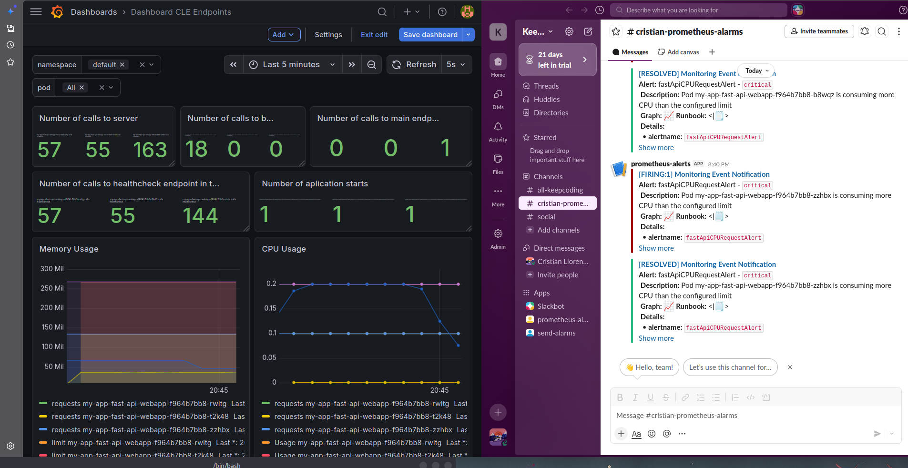

# Liberando Productos - Práctica Final

## Índice

1. [Creación del nuevo endpoint](#1-creación-del-nuevo-endpoint)
2. [Creación de tests unitarios](#2-creación-de-tests-unitarios)
3. [Creación pipelines CI/CD (GitHub Actions)](#3-creación-pipelines-cicd-github-actions)
4. [Añadiendo Semantic Release al pipeline](#4-añadiendo-semantic-release-al-pipeline)
5. [Configuración monitorización y alertas (Prometheus)](#5-configuración-monitorización-y-alertas-prometheus)
6. [Configuración FastAPI Helm Chart](#6-configuración-fastapi-helm-chart)
7. [Despliegue app en Minikube (K8S)](#7-despliegue-app-en-minikube-k8s)
8. [Monitorización métricas Prometheus con Grafana](#8-monitorización-métricas-prometheus-con-grafana)
9. [Pruebas de estrés](#9-pruebas-de-estrés)

---

## 1. Creación del nuevo endpoint

### 1.1 Descargo el repo "liberando-producto-practica-final"

### 1.2 Añado estas líneas en el `app.py` para crear el nuevo endpoint (Bye)

**Línea 15** — nuevo contador de Prometheus:

```python
BYE_ENDPOINT_REQUESTS = Counter('bye_requests_total', 'Total number of requests to bye endpoint')
```

**Líneas 51 a 58** — nuevo endpoint:

```python
@app.get("/bye")
async def bye_main():
    """Implement bye endpoint"""
    # Increment counter used for register the total number of calls in the webserver
    REQUESTS.inc()
    # Increment counter used for register the total number of calls in the bye endpoint
    BYE_ENDPOINT_REQUESTS.inc()
    return {"msg": "Bye Bye"}
```

---

## 2. Creación de tests unitarios

### 2.1 Añado estas líneas en el `app_test.py` para los tests del nuevo endpoint (Bye)

**Líneas 32 a 38:**

```python
@pytest.mark.asyncio
async def read_bye_test(self):
    """Tests the bye endpoint"""
    response = client.get("/bye")

    assert response.status_code == 200
    assert response.json() == {"msg": "Bye Bye"}
```

Para ejecutar los tests con cobertura:

```bash
pytest --cov
```

Resultado obtenido — 3 tests pasados con una cobertura del 92%:

```
src/tests/app_test.py::TestSimpleServer::read_health_test PASSED
src/tests/app_test.py::TestSimpleServer::read_main_test PASSED
src/tests/app_test.py::TestSimpleServer::read_bye_test PASSED

TOTAL   52   4   92%
```

### 2.2 Creo el repo en mi GitHub y subo el local con un commit inicial

---

## 3. Creación pipelines CI/CD (GitHub Actions)

### 3.1 Compruebo primero los pipelines que hay y modifico lo que necesito

**Testing** — tests unitarios con cobertura: no necesito modificar nada, ya que pasan todos los tests correctamente después de hacer el primer commit.

**Build & Push** — necesito modificar lo siguiente:

Modifico estas líneas del `Makefile` con mis datos de GitHub y DockerHub para subir la imagen Docker:

```makefile
IMAGE_REGISTRY_DOCKERHUB  ?= cristianllor
IMAGE_REGISTRY_GHCR       ?= ghcr.io
IMAGE_REPO                = cristtori
IMAGE_NAME                ?= liberando-productos-practica-final
VERSION                   ?= develop
```

En el `release.yaml` añado la parte de login a DockerHub para que me la suba también ahí, ya que en este pipeline solo estaba el login de GHCR. Lo hago añadiendo estas líneas después del step de login de GHCR:

```yaml
- name: Docker Login in DockerHub
  uses: docker/login-action@v1
  with:
    registry: docker.io
    username: ${{ secrets.DOCKERHUB_USERNAME }}
    password: ${{ secrets.DOCKERHUB_TOKEN }}
```

Añado mis credenciales de DockerHub en GitHub para poder subir la imagen:
- `DOCKERHUB_USERNAME` → `cristianllor`
- `DOCKERHUB_TOKEN` → `dckr_pat_cS_******************`

Hago un commit y push del repo indicando que modifico el pipeline de release (se ejecutan los tests en GitHub Actions).

### 3.2 Hago un commit añadiendo el tag v1.0.0 para comprobar el pipeline release

```bash
git tag v1.0.0
git push origin v1.0.0
```

> ⚠️ **ERROR:** Me da error al subir la imagen, ya que hay una línea que no admite el tag.
>
> ✅ **SOLUCIÓN:** Decido usar Semantic Release acordándome de lo que vimos en clase.

---

## 4. Añadiendo Semantic Release al pipeline

### 4.1 Creo el fichero que necesita Semantic Release en la raíz `.releaserc.json`

```json
{
  "branches": ["main"],
  "plugins": [
    "@semantic-release/commit-analyzer",
    "@semantic-release/release-notes-generator",
    "@semantic-release/github"
  ]
}
```

### 4.2 Modifico el pipeline de release

**Trigger** — quito la parte que dice que haga un push de la imagen cada vez que vea un tag `v*` y en su lugar lo hago en rama `main`:

```yaml
# Antes
on:
  push:
    tags:
      - 'v*'

# Después
on:
  push:
    branches:
      - 'main'
```

**Permisos** — añado los permisos para que el job de Semantic Release pueda crear releases y escribir en el repo:

```yaml
jobs:
  release:
    runs-on: ubuntu-latest
    permissions:
      contents: write
      packages: write
```

**Node.js y Semantic Release** — lo añado después del step `Unshallow` (esta herramienta necesita Node):

```yaml
- name: Setup Node.js
  uses: actions/setup-node@v4
  with:
    node-version: 20

- name: Install semantic-release
  run: npm install -g semantic-release @semantic-release/commit-analyzer @semantic-release/release-notes-generator @semantic-release/github
```

**Obtención de versión** — reemplazo el step que teníamos, ya que el comando estaba deprecado:

```yaml
# Antes
- name: Get the version to publish
  id: get_version
  run: echo ::set-output name=VERSION::${GITHUB_REF#refs/tags/v}

# Después
- name: Run semantic-release
  env:
    GITHUB_TOKEN: ${{ secrets.GITHUB_TOKEN }}
  run: npx semantic-release

- name: Get version
  id: get_version
  run: |
    VERSION=$(git describe --tags --abbrev=0 2>/dev/null || echo "")
    echo "VERSION=${VERSION#v}" >> $GITHUB_OUTPUT
```

**Condicional `if`** — añado un `if` a los siguientes pasos para que solo se ejecuten si Semantic Release ha creado una nueva versión:

```yaml
- name: Set up Docker Buildx
  if: steps.get_version.outputs.VERSION != ''
  uses: docker/setup-buildx-action@v3

- name: Docker Login in GHCR
  if: steps.get_version.outputs.VERSION != ''
  uses: docker/login-action@v3
  with:
    registry: ghcr.io
    username: ${{ github.actor }}
    password: ${{ secrets.GITHUB_TOKEN }}

- name: Build and push Docker image
  if: steps.get_version.outputs.VERSION != ''
  run: make publish
  env:
    VERSION: ${{ steps.get_version.outputs.VERSION }}
```

### 4.3 Hago commit y push indicando que añado Semantic Release y compruebo los test en Github Actions

> ⚠️ **ERROR:** Me dio error en el step de login de GHCR porque mi usuario tiene mayúsculas y debo ponerlo todo en minúsculas en las credenciales.

> ✅ **SOLUCIÓN:** Modifico las credenciales que tenía mal (`crisTTori` → `cristtori`) en el Makefile y hago un push con este cambio.

> ⚠️ **ERROR:** Me dio error en el pipeline de release porque la versión de FastAPI no es compatible con la versión de Python del Dockerfile:
> ```dockerfile
> FROM python:3.8.11-alpine3.14
> ```
>
> ✅ **SOLUCIÓN:** La modifico y le pongo una más actual:
> ```dockerfile
> FROM python:3.12-alpine
> ```

### 4.4 Hago commit y push indicando que cambio la versión de Python y compruebo que el pipeline se ejecuta correctamente

Compruebo que están las imágenes y releases subidas en GitHub y DockerHub. Como en este caso hice varios commits anteriores, Semantic Release me los detecta y me marca en este momento la versión `v1.0.2`, por lo que el pipeline funciona correctamente con el versionado automatizado.

La convención de commits que utiliza Semantic Release es la siguiente:

| Prefijo | Efecto sobre la versión |
|---------|------------------------|
| `fix:` | Sube el PATCH → `v1.0.1` |
| `feat:` | Sube el MINOR → `v1.1.0` |
| `feat!:` | Sube el MAJOR → `v2.0.0` |

---

## 5. Configuración monitorización y alertas (Prometheus)

### 5.1 Compruebo que tengo instalado Helm y el repo de Prometheus

```bash
helm version
helm repo add prometheus-community https://prometheus-community.github.io/helm-charts
helm repo update
```

### 5.2 Me creo una carpeta para todo lo relacionado a monitorización

```bash
mkdir -p monitoring/prometheus
```

### 5.3 Creo un nuevo canal de Slack

- Creo el canal `cristian-prometheus-alarms` en el workspace de Keepcoding
- Creo la App en Slack llamada `prometheus-alerts`
- Activo los **Incoming Webhooks**
- Guardo la Webhook URL para añadirla más tarde

> ⚠️ La URL del webhook no se incluye en el repositorio por seguridad. Se enviará al tutor.

### 5.4 Descargo el `values.yaml` del lab de la clase 3 y lo ajusto con mis datos

**Canal de Slack:**

```yaml
api_url: '****' # Webhook enviado al profesor por email
channel: '#cristian-prometheus-alarms'
```

**Alertas** — borro las alertas de MongoDB y memoria que vienen en el `values.yaml` original, ya que la app no usa base de datos, y añado esta nueva alerta de CPU con `severity: critical`:

```yaml
additionalPrometheusRulesMap:
  rule-name:
    groups:
      - name: ruleset_1
        rules:
          - alert: fastApiCPURequestAlert
            expr: avg(rate(container_cpu_usage_seconds_total{pod=~"my-app-fast-api-webapp-.*"}[1m])) by (pod) > avg(kube_pod_container_resource_limits{resource="cpu",container="fast-api-webapp"}) by (pod)
            for: 0m
            labels:
              severity: critical
            annotations:
              summary: Pod {{ $labels.pod }} consuming more CPU than limit
              description: "Pod consuming more CPU than limit"
              message: Pod {{ $labels.pod }} is consuming more CPU than the configured limit
```

**Dashboard de MongoDB** — borro también esta sección de Grafana que no necesitamos:

```yaml
mongodb:
  gnetId: 16490
  revision: 1
  datasource: Prometheus
```

---

## 6. Configuración FastAPI Helm Chart

### 6.1 Descargo el chart de Helm de la aplicación FastAPI con el que trabajamos en la clase 3

Lo meto dentro de una nueva carpeta en la raíz del proyecto llamada `helm`.

### 6.2 Modifico el `values.yaml` del chart con mi imagen

```yaml
image:
  repository: ghcr.io/cristtori/liberando-productos-practica-final
  pullPolicy: IfNotPresent
  tag: "1.0.2"
```

### 6.3 Modifico el `deployment.yaml` en templates quitando toda la parte de MongoDB

Borro estas dos partes ya que en esta app no utilizaremos base de datos:

```yaml
# Bloque 1 - initContainer que esperaba a que MongoDB estuviera listo
initContainers:
  - name: wait-mongo
    image: mongo:{{ .Values.mongodb.version }}
    command: ['bin/bash']
    args: ['-c', 'until [[ $(mongosh "${MONGODB_ADMIN_URL}" --quiet --eval "rs.status().ok") == 1 ]]; do echo waiting for mongodb to be ready; sleep 2; done']
    envFrom:
      - secretRef:
          name: {{ include "fast-api-webapp.fullname" . }}-secret

# Bloque 2 - referencia al secret de MongoDB en el contenedor principal
envFrom:
  - secretRef:
      name: {{ include "fast-api-webapp.fullname" . }}-secret
```

### 6.4 Borro los yaml de templates que no necesito

- `mongodb.yaml`
- `mongodb_secret.yaml`
- `dockerhub_access.yaml` — la imagen se descargará de GHCR público, no se necesitan credenciales

---

## 7. Despliegue app en Minikube (K8S)

### 7.1 Arranco Minikube, habilito metrics-server y creo el namespace de monitoring

```bash
minikube start
minikube addons enable metrics-server
kubectl create namespace monitoring
```

El addon `metrics-server` es necesario para que el HPA pueda obtener las métricas de CPU y escalar los pods automáticamente.

### 7.2 Despliego los charts de Prometheus y FastAPI

> ⚠️ **Importante:** hay que desplegar Prometheus **antes** que la aplicación, ya que el `ServiceMonitor` del chart de FastAPI requiere los CRDs que instala `kube-prometheus-stack`. Si se instala en orden inverso el despliegue fallará.

```bash
helm repo update
helm install prometheus prometheus-community/kube-prometheus-stack \
  -f monitoring/prometheus/values.yaml \
  -n monitoring
```

Esperar a que todos los pods estén en estado `Running` antes de continuar:

```bash
kubectl get pods -n monitoring -w
```

Una vez listos, desplegar la aplicación en el namespace `default` (no hace falta crearlo, ya existe por defecto en Kubernetes):

```bash
helm install my-app helm/fast-api-webapp -n default
```

### 7.3 Hago port-forward para comprobar el servicio de la app

Una vez el pod del deployment esté `Ready` (`kubectl get pods`):

```bash
kubectl port-forward svc/my-app-fast-api-webapp 8081:8081 -n default
```

Compruebo que cada endpoint devuelve el mensaje esperado:

```bash
curl http://localhost:8081/        # {"msg": "Hello World"}
curl http://localhost:8081/health  # {"health": "ok"}
curl http://localhost:8081/bye     # {"msg": "Bye Bye"}
```

### 7.4 Port-forward para verificar que Prometheus funciona bien

```bash
kubectl port-forward svc/prometheus-kube-prometheus-prometheus 9090:9090 -n monitoring
```

Abro el navegador en `http://localhost:9090` y compruebo que en **Status → Targets** aparece la aplicación `fast-api-webapp` con estado `up`.

---

## 8. Monitorización métricas Prometheus con Grafana

### 8.1 Hago port-forward para ingresar en Grafana desde el navegador

```bash
kubectl port-forward svc/prometheus-grafana 3000:http-web -n monitoring
```

Accedo mediante `http://localhost:3000`:
- **User:** `admin`
- **Password:** `prom-operator`

> ⚠️ **ERROR:** Me dio un error de credenciales.
>
> ✅ **SOLUCIÓN:** Ejecuto el siguiente comando para obtener el password real, ya que se genera automáticamente en cada instalación:
>
> ```bash
> kubectl get secret prometheus-grafana -n monitoring \
>   -o jsonpath="{.data.admin-password}" | base64 -d && echo
> ```

### 8.2 Compruebo los Dashboards preconfigurados y creo uno nuevo con la plantilla de la clase 3

```
Dashboards → New → Import → selecciono el fichero custom_dashboard.json
```

### 8.3 Dentro de ese Dashboard selecciono el namespace `default` donde está nuestra app

Aparecen las siguientes métricas del dashboard original de clase:
- Nº llamadas al servidor
- Llamadas al endpoint `main`
- Llamadas a "crear estudiantes"
- Uso de memoria
- Uso de CPU

### 8.4 Ajusto el dashboard con estos 4 cambios

**Nº de llamadas a "crear estudiantes"** — sale `No data` porque en esta app no existe ese endpoint. La edito y la sustituyo por la del nuevo endpoint `/bye`:
- Nombre: `Number of calls to bye endpoint`
- Query: `bye_requests_total`

**Nº de llamadas al servidor** — tenía la misma query que el endpoint `main`. La corrijo para que muestre el total real de llamadas al servidor:

```promql
# Antes
sum(last_over_time(main_requests_total[$__rate_interval])) by (pod)

# Después
sum(last_over_time(server_requests_total[$__rate_interval])) by (pod)
```

**Nº de veces que la aplicación ha arrancado** — añado un nuevo panel con la query siguiente. Le añado `+1` al final porque la métrica solo detecta reinicios, no el arranque inicial:

```promql
kube_pod_container_status_restarts_total{container="fast-api-webapp"} + 1
```

**Uso de CPU** — no se veía el consumo real de CPU, solo los límites. La query de la métrica `C` tenía el namespace incorrecto:

```promql
# Antes (namespace incorrecto hardcodeado)
rate(container_cpu_usage_seconds_total{namespace="pdftron-webviewer", cluster="$cluster", container!=""}[$__rate_interval])

# Después
rate(container_cpu_usage_seconds_total{pod=~"my-app-fast-api-webapp-.*"}[$__rate_interval])
```

Después de comprobar que todas las métricas funcionan, exporto el Dashboard modificado y lo guardo en la raíz del proyecto como `dashboard-CLE.json`.

---

## 9. Pruebas de estrés

### 9.1 Identifico el pod de la aplicación y lo selecciono en Grafana

```bash
export POD_NAME=$(kubectl get pods --namespace default \
  -l "app.kubernetes.io/name=fast-api-webapp,app.kubernetes.io/instance=my-app" \
  -o jsonpath="{.items[0].metadata.name}")
echo $POD_NAME
```

### 9.2 Accedo mediante una shell al contenedor

```bash
kubectl exec --stdin --tty $POD_NAME -- /bin/sh
```

### 9.3 Instalo las herramientas necesarias para la prueba de estrés

```bash
apk update && apk add stress-ng
```

### 9.4 Ejecuto la prueba de estrés dentro del contenedor

```bash
stress-ng --cpu 1 --cpu-load 40 --timeout 300
```

Este comando genera carga de CPU durante 5 minutos, suficiente para superar el límite configurado de `200m` y disparar la alerta.

### 9.5 Mientras tanto abro otras terminales para comprobar el HPA y los pods

```bash
kubectl -n default get hpa -w
kubectl -n default get pod -w
```

### 9.6 Voy al canal de Slack y compruebo las alertas

Veo cómo llega la alerta cuando el consumo supera el límite configurado:

```
[FIRING:1] Monitoring Event Notification
Alert: fastApiCPURequestAlert - `critical`
Description: Pod my-app-fast-api-webapp-xxxx is consuming more CPU than the configured limit
Details:
  • alertname: fastApiCPURequestAlert
  • pod: my-app-fast-api-webapp-xxxx
  • severity: critical
```

Y cuando el consumo baja o el HPA escala los pods, llega automáticamente la recuperación:

```
[RESOLVED] Monitoring Event Notification
Alert: fastApiCPURequestAlert - `critical`
```
---

## Resultado final

A continuación se muestra el dashboard de Grafana con las métricas de la aplicación junto a las alertas recibidas en el canal de Slack:

